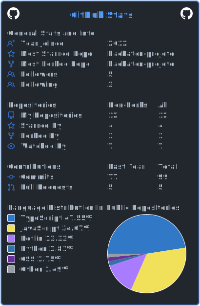

# Olá! Eu sou o João Gabriel 👋

  <i>
    "Em constante evolução, aprendendo um pouco a cada projeto."
  </i>

---

## Sobre mim

- Estudante de programação e focado em crescer como desenvolvedor.
- Tenho 18 anos e concluí o Ensino Médio Técnico em Informática na UNIVAP.
- Buscando oportunidades para atuar como dev.
- PT-BR / ENG

---

## Tecnologias que uso

  

---

## Áreas de interesse

- Back-end
- APIs REST
- Banco de dados
- Infraestrutura e redes
- Cybersegurança

---

  

---

## Contato

  
  

---

  <picture>
    <source media="(prefers-color-scheme: dark)" srcset="https://raw.githubusercontent.com/Knnyxz/Knnyxz/output/github-contribution-grid-snake-dark.svg" />
    <source media="(prefers-color-scheme: light)" srcset="https://raw.githubusercontent.com/Knnyxz/Knnyxz/output/github-contribution-grid-snake.svg" />
    
  </picture>

